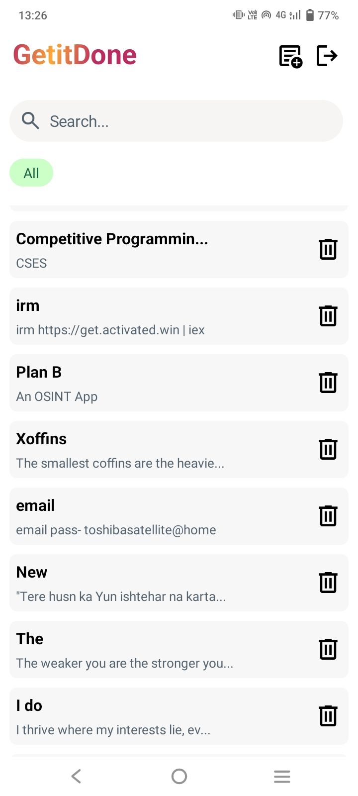
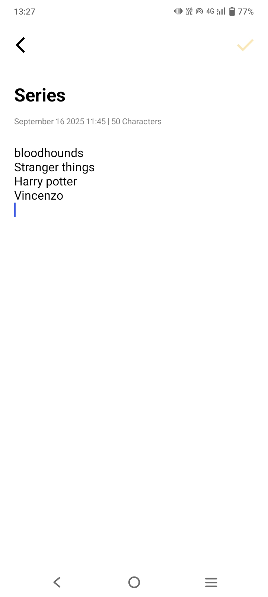

# GetitDone — Streamline daily tasks & take important notes.

## Features

- Clean and simple UI
- Provides user authentication
- Stores data on cloud — seamless synchronization across devices
- Allows searching, and includes timestamp for each note
- Create, edit, and delete notes with ease

## Technologies

- XML
- Java
- Firebase Cloud Services

## Usage

1. Install the app
2. Signup & create a new account
3. Start taking notes

## Screenshots

<table>
<tr>
<td></td>
<td></td>
</tr>
</table>

## Author
Sadique Khan
