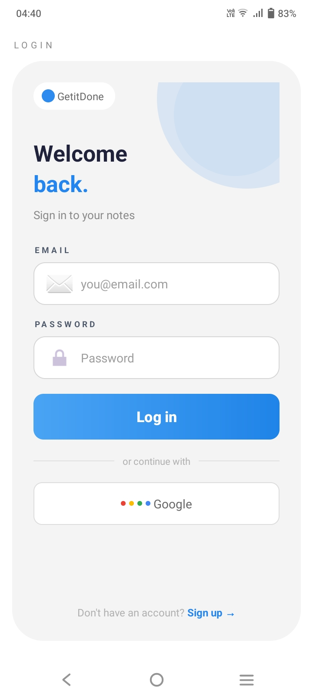
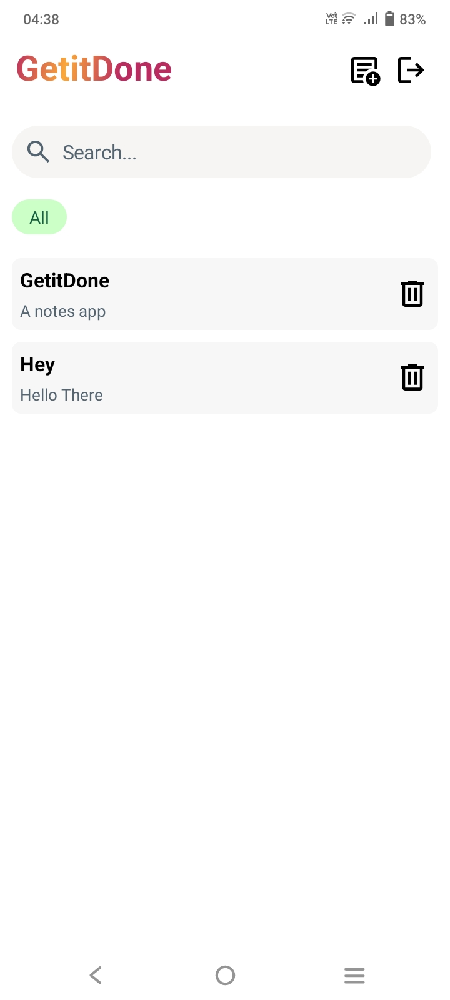
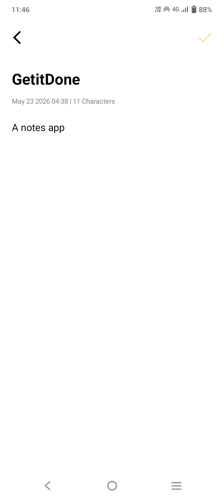

# GetitDone

### A clean, minimal Android task manager — powered by Firebase


---

## 📸 Screenshots

|         Login / Sign Up          |              Home              |                 New Task                  |
|:--------------------------------:|:------------------------------:|:-----------------------------------------:|
|  |  |  |

---

## ✨ Features

- 🔐 **Email/Password Authentication** — Sign up and log in with email and password
- 🔵 **Google Sign-In** — One-tap sign-in with any Google account
- 📝 **Create & Edit Tasks** — Write tasks with a title and content body
- ⚡ **Real-time Sync** — Tasks sync instantly across devices via Firestore Snapshot Listener
- 📶 **Offline Support** — Tasks load from Firestore cache when offline
- 🔍 **Search** — Filter tasks by title in real-time
- 🔄 **Auto-login** — Stays logged in across app restarts via SharedPreferences
- 🚫 **Duplicate Title Guard** — Prevents saving two tasks with the same title
- 💾 **Persistent Login State** — Session survives app kill and relaunch

---

## 🛠️ Tech Stack

| Layer | Technology |
|---|---|
| Language | Java |
| Min SDK | 23 (Android 6.0) |
| Target SDK | 34 |
| Auth | Firebase Authentication |
| Database | Firebase Firestore |
| Google Sign-In | Google Play Services Auth 21.2.0 |
| UI | Material 3, RecyclerView, ConstraintLayout |
| Build | Gradle (Kotlin DSL) |

---

## 📁 Project Structure

```
app/src/main/java/com/example/getitdone/
│
├── DecisiveLauncherActivity.java   # Entry point — routes to Login or Home based on session
├── LoginPage.java                  # Email/password + Google Sign-In
├── SignUpPage.java                 # Registration + Google Sign-In
├── HomePage.java                   # Task list with search, real-time listener, logout
├── CreateTask.java                 # Create and edit tasks
│
├── TaskDataModel.java              # Task POJO — Firestore-serializable
├── TaskAdaptor.java                # RecyclerView adapter
├── TaskViewHolder.java             # ViewHolder for task items
├── TaskDiffCallaback.java          # DiffUtil for efficient list updates
├── TaskDeleter.java                # Firestore delete helper
│
├── UserCredentials.java            # Static holder for current user's collection name
├── ActualPosition.java             # Tracks task positions for duplicate title check
├── CurrentTaskPosition.java        # Tracks which task is being edited
│
├── CustomizedActivityBars.java     # Status/navigation bar styling
├── CustomHintSize.java             # Programmatic hint text sizing
├── MetaDataFormatter.java          # Formats title and content for display
└── GradientTextView.java           # Custom view with gradient text
```

---

## 🚀 Setup

### Prerequisites

- Android Studio (Hedgehog or newer)
- A Firebase project with **Authentication** and **Firestore** enabled

### Steps

1. **Clone the repo**
   ```bash
   git clone https://github.com/eriknox7/GetitDone.git
   ```

2. **Connect to Firebase**
    - Go to [Firebase Console](https://console.firebase.google.com)
    - Create a project (or use existing)
    - Add an Android app with package name `com.example.getitdone`
    - Download `google-services.json` and place it in `app/`

3. **Add SHA-1 & SHA-256 fingerprints**

   Run in PowerShell:
   ```powershell
   keytool -list -v -keystore "$env:USERPROFILE\.android\debug.keystore" -alias androiddebugkey -storepass android -keypass android
   ```
   Add both SHA-1 and SHA-256 to Firebase Console → Project Settings → Your App → SHA certificate fingerprints, then re-download `google-services.json`.

4. **Enable Sign-In methods in Firebase**
    - Authentication → Sign-in method → Enable **Email/Password**
    - Authentication → Sign-in method → Enable **Google**

5. **Build and run**

   Open in Android Studio and run on a device or emulator.

---

## 🔐 Authentication Flow

```
App Launch
    └── DecisiveLauncherActivity
            ├── isLoggedIn = true  ──────────────────────► HomePage
            └── isLoggedIn = false ──► LoginPage
                                            ├── Email/Password ──► HomePage
                                            ├── Google Sign-In ──► HomePage
                                            └── ──► SignUpPage
                                                        ├── Email/Password ──► HomePage
                                                        └── Google Sign-In ──► HomePage
```

On successful auth, the user's email is stored as their Firestore collection name (`UserCredentials.userCollection`), and login state is persisted in SharedPreferences.

---

## 🗄️ Firestore Data Structure

Each user's tasks are stored under a collection named after their email:

```
Firestore
└── {user@email.com}              ← collection (one per user)
    └── {taskTitle}               ← document ID = task title
        ├── title:     String
        ├── content:   String
        ├── date:      String
        ├── time:      String
        ├── length:    String
        └── createdAt: Timestamp
```

---

## ⚠️ Important Notes

- **Release builds** require SHA-1/SHA-256 from your **release keystore** added to Firebase — Google Sign-In will fail in production without this.
- Firestore **security rules** should be configured before going to production to restrict each user to their own collection.
- `google-services.json` is **not committed** to version control — each developer must add their own.

---

## 📦 Version History

| Version | Changes |
|---|---|
| 1.1 | Google Sign-In, Snackbar notifications, real-time Firestore sync, offline support, DiffUtil list updates |
| 1.0 | Initial release — email auth, task CRUD, Firestore |